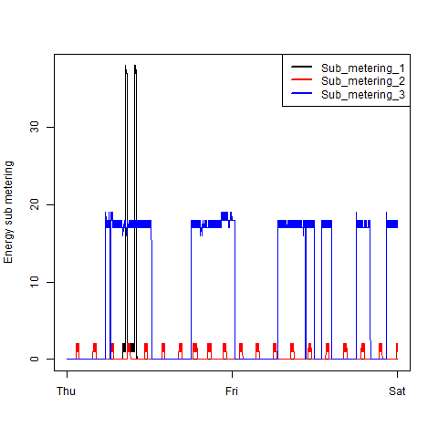
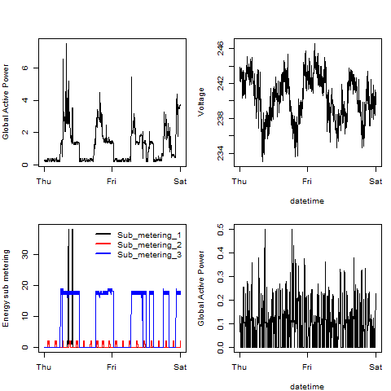

# Exploratory Data Analysis
Course Project 1 for Coursera: Exploratory Data Analysis (2015-May)
Rob Rolleston

See: [README_Original.md](https://github.com/RobRolleston/ExData_Plotting1/blob/master/README-Original.md) for the problem assignment.  

_NOTE_: The scripts require the package 'sqldf' to read the data file.  

## My Solution

### Plot 1

 

### Plot 2

 

### Plot 3

 

### Plot 4

 

